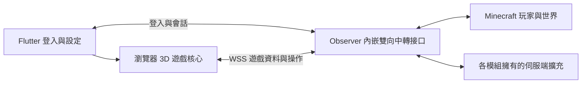

# Observer 對外遊戲接口：Flutter 客戶端可行性調查

日期：2026-09-11。狀態：調查與架構提案，尚未實作或完成連線實測。

目標：服主安裝 Observer 後，模組本身成為可傳輸與接收的雙向中轉站；玩家用自訂帳號登入 Flutter 網頁，直接進入同一個 Minecraft 世界遊玩。玩家端不需要啟動 Java Minecraft；不使用 framebuffer、截圖或影片串流。不能把另裝一套自訂閘道服務當成必要前提。

使用者進一步確認：Flutter 網頁端是操作介面。Minecraft 伺服器繼續執行世界模擬、遊戲規則與模組邏輯；Observer 傳出狀態並接收操作；網頁呈現世界/介面、處理輸入。若要一般 MC 的 3D 操作體驗，網頁仍需要渲染與必要的移動預測/校正，但不需要另造一套伺服器遊戲規則。

## 結論

有條件可行，適合先做限定範圍的技術原型；目前不能承諾完整原版與所有 Totem 模組相容。現有 Observer 不是外部遊戲客戶端 API，必須新增專用的遊玩接入層。最大不確定性是 26.2 客戶端相容性、自訂帳號如何建立正常玩家連線，以及正式模組畫面如何滿足目前的渲染契約。

建議先採 Flutter 應用介面搭配瀏覽器 3D 遊戲核心，避免先用 Dart 重寫完整客戶端。這是技術選型建議，不是已驗證可用的整合。第一輪固定桌面瀏覽器、Minecraft 26.2、基本方塊與兩個玩家；手機與完整模組功能另設驗收。

## 現有程式證據

Observer 原始碼基準：`ce48db6e733b9c3ed4efddea3cb9e8aa53032099`，版本 0.1.1，Minecraft 26.2。圖譜中的 0.1.0 為較舊快照，本調查以現有原始碼為準。

| 證據 | 架構意義 |
| --- | --- |
| [README](../README.md) 與 [ObserverSessionManager](../src/main/java/dev/totem/observer/runtime/ObserverSessionManager.java) | `/observeui` 需要已有玩家，切換 spectator/camera，不能用作遊玩 session 或玩家建立 API。 |
| [ObserverScreenProvider](../../TotemCore/src/main/java/dev/totem/core/api/v1/client/observer/ObserverScreenProvider.java) | `capture(Screen, sequence)`、`create(...)` 依賴 Minecraft 客戶端；專用伺服器不能直接呼叫。 |
| [ObserverScreenSnapshot](../../TotemCore/src/main/java/dev/totem/core/api/v1/client/observer/ObserverScreenSnapshot.java) | 有版本、序號與資料上限；slots 256、data 128、metadata 64、owner payload 64 KiB。這是畫面快照，不是世界區塊串流。 |
| [ObserverOwnedScreenPayloads](../src/main/java/dev/totem/observer/network/ObserverOwnedScreenPayloads.java) | 使用 Minecraft CustomPacketPayload、RegistryFriendlyByteBuf 與 ItemStack 編碼，不能直接當 Dart/JSON API。 |
| [ObserverPayloadRegistration](../src/main/java/dev/totem/observer/runtime/ObserverPayloadRegistration.java) | 現有入口是 Fabric 遊戲內封包；在本次檢查的 runtime/network 範圍未找到外部 WebSocket/HTTP 接入、世界串流或新玩家建立接口。 |

可以延續版本協商、資料限額、序號檢查、權限撤銷與 provider ownership 的設計。既有唯讀 Screen API、friend/admin 觀察權限與防止操作的 firewall 不能改成外部遊玩權限。

## 外部技術調查

以下是查閱文件與原始碼的結果，不是本機或 CI 執行證據。上游分支可能變動；原型開始時須固定 commit 與 lockfile。

| 候選 | 查到的能力 | 限制與判斷 |
| --- | --- | --- |
| Prismarine Web Client | 瀏覽器執行 Mineflayer 與 viewer，WebSocket 代理轉 TCP；已有地形、玩家、移動與放置/破壞方塊。 | README 仍將容器、聲音等列為 roadmap，適合參考架構，不能視為完整遊戲。 [來源](https://raw.githubusercontent.com/PrismarineJS/prismarine-web-client/master/README.md) |
| zardoy/minecraft-web-client | TypeScript 客戶端，Three.js/WebGL2、觸控、資源包與自架部署。 | README 宣告 1.8–1.21.5，主要測試 1.19.4/1.21.4；專案描述標示 maintenance only。不能從較新的套件依賴推論完整 26.2 支援。列為首要評估候選，尚未選定。 [來源](https://github.com/zardoy/minecraft-web-client) |
| node-minecraft-protocol / Mineflayer | 協定編解碼與較高階的遊戲操作 API。 | 查閱時 supportedVersions 與 Mineflayer 文件宣告到 26.1，未列 26.2。 [協定程式](https://raw.githubusercontent.com/PrismarineJS/node-minecraft-protocol/master/src/version.js)、[Mineflayer](https://github.com/PrismarineJS/mineflayer) |
| minecraft-data | 版本資料已列出 26.2、protocol 776。 | 版本號資料存在不代表區塊、物品、物理、登入或瀏覽器客戶端已相容。 [來源](https://raw.githubusercontent.com/PrismarineJS/minecraft-data/master/data/pc/common/protocolVersions.json) |
| Flutter Web | HtmlElementView 可嵌入 HTML 元素，文件說明輸入事件與疊層處理。 | 可用於嵌入遊戲 canvas；仍須測試焦點、滑鼠鎖定、觸控與 Flutter 覆蓋介面。這不等於 Flutter 提供 Minecraft 3D 引擎，也不證明手機 WebView 可直接沿用。 [來源](https://docs.flutter.dev/platform-integration/web/web-content-in-flutter) |

## 提議的所有權與部署

Observer 擁有對外遊戲接口、capability negotiation、遊玩 session 與伺服端適配。Core 僅在確定多模組需要穩定共用契約後才新增 server-safe API；各功能模組仍擁有資料解釋、操作規則與正式畫面。

依使用者澄清，首選 Observer 內嵌網路接入與會話管理，不另要求自訂 sidecar。登入驗證及角色映射由 Observer 內部服務負責，Minecraft 原有模組相依仍須滿足。Flutter 可使用固定託管網址連到服主接口；若要連前端都由服主一併提供，再評估 Observer 提供靜態檔案。網址託管位置不改變 Observer 是遊戲中轉站的定位。

安裝模組仍需明確的監聽位址、連接埠與對外可達性設定；公網 HTTPS/WSS 憑證由內嵌 TLS 或服主既有反向代理終止。這些是部署設定，不能宣稱放入 JAR 就能自動穿透防火牆或 NAT。原型須驗證專用伺服器啟動/關閉會一併啟動/釋放接口，網路工作不阻塞 server tick。

中轉方向：伺服器的玩家可見世界/角色/容器狀態 → Observer 有界編碼與發送 → Flutter；Flutter 輸入/操作 → Observer 驗證 session、序號與權限 → 正常伺服器遊戲流程 → 權威狀態回傳。若走原生協定，內嵌入口還須銜接 Minecraft connection pipeline；現有 Fabric custom payload receiver 不能直接接瀏覽器 WebSocket。

外部服務不得使用 TotemWorkspace 的開發 Bridge：那是開發工具，並非玩家接入服務。遊戲世界資料與 GPU 渲染在玩家裝置處理，不需要每人一個伺服器端圖形客戶端。

## 兩條遊戲接入路線

| 路線 | 優勢 | 必須補足 | 選擇條件 |
| --- | --- | --- | --- |
| A：原生 Minecraft 遊戲協定經 WSS 接入，Observer 提供受驗證入口與模組擴充 | 最能沿用現有瀏覽器客戶端與正常遊戲封包流程。 | 26.2 協定及客戶端支援、自訂身分 admission adapter、Fabric registry/custom payload、資源與模組能力協商。單純 WS→TCP 代理無法把自訂帳密變成 MC 登入。 | 優先做相容性試驗；只有實際跑通 26.2 才能選為主線。 |
| B：Observer 自訂世界/操作協定與伺服端玩家適配 | 對外格式可獨立版本化，也可直接取得伺服器資料。 | 世界複本、實體/區塊增量、物理預測、容器狀態、事件、資源與玩家生命週期都要接入；只能部分重用既有客戶端。 | A 無法達成時才估價；不能當成免費避開版本相容性的捷徑。 |

不以修改版本字串、增加 protocolVersions 條目或舊版轉接代理當作 26.2 支援證據。也不把 server fake player 建立成功當作能正常睡眠、死亡、換維度、操作容器與模組相容的證據。

## 自訂帳號與權限

Observer 內的帳號服務驗證登入；伺服器根據帳號 ID 指派固定、獨立命名空間的玩家 UUID。客戶端不能自行決定 UUID、冒用角色名稱或指定 OP。必須規劃與既有 Java 玩家存檔的碰撞處理、重複登入與封鎖語意。

自訂帳號不會通過原有 Microsoft/Minecraft online authentication。首選在 Observer 內實作限定於外部受驗證入口的登入/玩家適配；在驗證前不宣稱一般 online-mode 伺服器可以直接接受。不能為此全面放寬公開 Java 入口的驗證。

短效票證綁定伺服器、帳號、session 與用途；帳密不進 URL、快照或遊戲記錄。唯讀 observation 與 play session 分離，觀察權限不授予角色操作。網路解碼有上限，變更世界在伺服器執行緒驗證；離線、撤銷或逾時立即清除持續輸入。

## 對外接口草案（尚非正式契約）

控制面提供登入、建立/恢復遊玩 session、能力協商與關閉。遊戲面可走 A 的原生協定，或 B 的版本化訊息；不要同時維護兩套背包/玩家狀態的權威來源。

B 若被選定，最少需要：registry/resource manifest、區塊初始資料/更新/卸載、實體生成/更新/移除、玩家狀態、輸入與確認、容器狀態與操作、世界事件，以及斷線恢復。訊息需包含 session epoch、維度/世界識別、sequence 與對應狀態版本；換世界或重連不接受舊訊息。慢客戶端需有背壓、限額與重新同步機制，不能每 tick 重送整個世界。

操作必須核對玩家、權限、距離與當前遊戲狀態；容器操作核對 menu ID/state ID，不提供任意 NBT、任意物品生成或代替玩家執行任意管理命令的入口。數值限額與效能預算待原型量測後固定。

資源取得必須涵蓋方塊模型、材質、物品、聲音與模組新增資源；列出可部署的來源與版本清單，不能只傳 registry ID 就宣稱能渲染所有模組內容。

## 完整畫面相容性的未解門檻

目前工作區要求 Observer reconstruction 使用 owning module 的正式渲染路徑；vanilla 要實際 Mojang Screen/Menu，禁止替代仿畫、反射複製與 framebuffer。純 Flutter/TypeScript 畫面無法直接執行現有 Java Screen provider。

因此不能把瀏覽器重畫的容器或 Totem 畫面宣稱為符合現有 Observer reconstruction。外部可操作客戶端需要獨立的產品契約與 owner 提供的適配；若目標仍要求與現有重建相同的正式渲染路徑，就必須另做客戶端運行/移植可行性調查。這是進入完整 GUI/Totem 支援階段前需要解決的架構決策，不能靠更名接口繞過。

## 分階段試驗與停止條件

| 階段 | 實際交付與驗收 | 未通過時 |
| --- | --- | --- |
| P0 相容性與角色接入 | 固定瀏覽器核心/依賴 commit；在隔離 26.2 測試伺服器驗證 configuration/login/play、registry 與區塊解碼；證明受驗證自訂身分能建立正常角色且無法冒名。 | 列出具體缺口，重新評估 A/B；不先全面開發 Flutter UI。 |
| P1 最小多人遊玩 | Flutter 登入、兩個獨立帳號、世界地形、彼此可見、移動/跳躍/挖放方塊、正常碰撞與校正、登出重登保留位置/背包。伺服器重啟也須保存。 | 修正會話、同步或存檔；不得宣稱完整可玩。 |
| P2 基本生存 | 合成、容器、戰鬥、掉落/拾取、死亡/重生、換維度、食物、聊天、聲音；驗證高延遲、重連與物品守恆。 | 按功能維持明確支援矩陣。 |
| P3 Totem 與完整畫面 | 先解決正式畫面契約；逐個模組驗證 provider/外部適配、物品模型、權限與效果，缺少能力時明確拒絕。 | 不默默降級為有誤的替代畫面或忽略 custom payload。 |
| P4 發佈與裝置 | 新環境一套部署可啟動；桌面/Android/iOS 分別驗收；量測 FPS、載入時間、記憶體、每玩家頻寬、server tick 與同時連線。 | 限制已測平台與人數；不承諾任意手機或任意服主硬體。 |

尚無執行量測，不能可靠估算完成日、同時在線人數、FPS 或 token 節省比例。先為 P0 設定有限投入，再根據實際缺口估工；完整原版加 Totem 同等體驗屬大型客戶端相容工程。

## 自動化與此次調查的驗證範圍

未新增或執行遊戲原型、依賴安裝、模組 build 或 runtime 測試；本次只有原始碼/官方與上游文件調查及文件審查。未驗證上述技術棧在本機可連線，也沒有發佈、推送或更動伺服器設定。

實作階段由固定程式與 GitHub Actions 擁有：帳號冒用/重複登入、過期與撤銷、協定 codec/版本不合、亂序/重連、非法操作、物品守恆、死亡/存檔、多玩家隔離與 headless 專用伺服器載入。瀏覽器 E2E 在實際 26.2 世界驗證操作結果，不能只驗 UI 按鈕或 mock 回應。效能固定場景留存機器與負載條件；必要的渲染與手感判讀另留一次審查證據。

沿用 [validation ownership](../../TotemWorkspace/docs/validation-ownership.md)：相同 source/dependency/toolchain 與檢查範圍的成功 CI 結果直接沿用。既有 Observer 唯讀回歸仍由其 owning workflow 執行；新外部遊玩測試不能取代它。

本文件已完成獨立架構審查：條件式可行性及 Observer 內嵌雙向接口定位無阻擋發現；依審查移除首選架構中可能暗示另需獨立後端的描述。7 個本機文件連結存在，程式碼圍欄配對通過。intelligence impact/test_plan 已取得；其模組級 runtime 分類保留為未來實作需求，本次僅文件變更依 validation ownership 不重跑遊戲 build。
